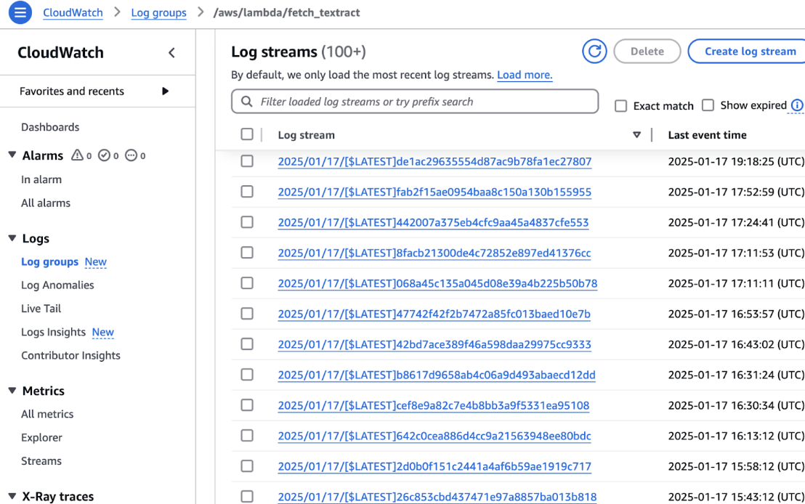
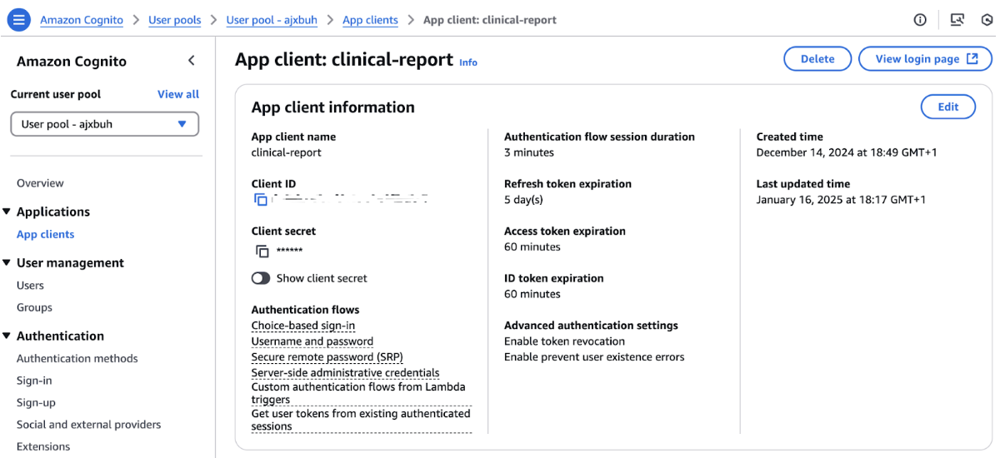
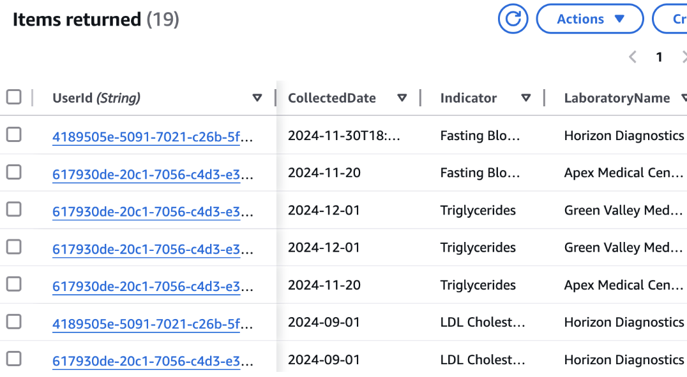

# Medical Reports Tracker


## Table of Contents

1. [Project Overview](#project-overview)
2. [Product Overview](#product-overview)
   - [Key Features](#key-features)
   - [User Flow](#user-flow)
3. [Architecture](#architecture)
   - [Tech Stack](#tech-stack)
   - [Project Structure](#project-structure)
4. [Implementation Details](#implementation-details)
   - [AWS Service Flows](#aws-service-flows)
     - [Upload Flow](#upload-flow)
     - [Textract Flow](#textract-flow)
     - [Indicator Information Save Flow](#indicator-information-save-flow)
   - [Backend Implementation](#backend-implementation)
   - [Frontend Implementation](#frontend-implementation)
5. [Setup and Deployment](#setup-and-deployment)
   - [Local Development Setup](#local-development-setup)
     - [Frontend Setup](#frontend-setup)
     - [Backend Setup](#backend-setup)
   - [AWS Configuration](#aws-configuration)
     - [Cognito User Pool](#cognito-user-pool)
     - [S3 Buckets](#s3-buckets)
     - [DynamoDB](#dynamodb)
     - [Lambda Functions](#lambda-functions)
     - [IAM Roles](#iam-roles)
6. [Future Plans](#future-plans)


## Project Overview

Medical Reports Tracker is designed to help users transform unstructured clinical reports into actionable health metrics. The platform combines a React frontend with a Flask backend and leverages AWS services to provide OCR processing, secure authentication, and interactive data visualizations.

## Product Overview
### Key Features

- **User Authentication**: Secure login with AWS Cognito.
- **Report Upload**: Upload clinical reports as images.
- **Serverless Processing Pipeline**:
  - **Lambda Function `fetch_textract.py`**: Initiates AWS Textract OCR processing on reports uploaded to S3.
  - **Lambda Function `process_extracted_data.py`**: Extracts structured data and stores it in DynamoDB.
  - Asynchronous workflow utilizing SQS between steps.
- **Data Storage and Persistence**:
  - Health data storage in DynamoDB with user and patient identifiers.
  - Efficient querying using composite keys (`UserId`, `PatientId#TestDateTime#Indicator`).
  - Automatic data partitioning for scalability.
- **Cloud Service Monitoring and Debugging**:
  - AWS CloudWatch Logs for monitoring Lambda functions.
- **Data Visualization**: Interactive charts to track health metrics over time.
- **Data Editing**: Review and edit extracted data points.

### User Flow


1. **Authentication**: The user logs in via AWS Cognito.
2. **Home View**: The user views existing health metrics on the dashboard.
3. **Upload Flow**:
   - The user uploads a clinical report image.
   - The system processes the image with AWS Textract.
   - The user reviews the extracted data.
   - The user confirms the data for storage and visualization.
4. **Visualization**: The user views trends in health indicators over time via interactive charts.


## Architecture

### Tech Stack

**Frontend**:
- React
- Plotly

**Backend**:
- Flask (Python)
- AWS Services:
  - S3 (Storage)
  - Textract (OCR)
  - DynamoDB (Database)
  - Lambda (Serverless Functions)
  - Cognito (Authentication)
  - SQS (Message Queue)

### Project Structure

```
clinical-insights/
│
├── frontend/                   # React frontend application
│   ├── public/                 # Static files
│   ├── src/                    # Source code
│   │   ├── components/         # Reusable UI components
│   │   │   ├── common/         # Shared components (LoadingSpinner, ErrorMessage, etc.)
│   │   │   ├── Header/         # Header component
│   │   │   ├── Layout/         # Layout components
│   │   │   └── PrivateRoute/   # Route protection component
│   │   ├── contexts/           # React contexts (AuthContext, etc.)
│   │   ├── screens/            # Main application screens
│   │   │   ├── Auth/           # Authentication screens
│   │   │   ├── Home/           # Dashboard/home screen
│   │   │   ├── Review/         # Data review screens
│   │   │   ├── SignIn/         # Sign-in screen
│   │   │   └── Upload/         # File upload screens
│   │   ├── services/           # API service integrations
│   │   ├── styles/             # Global styles and theme
│   │   ├── utils/              # Utility functions
│   │   ├── App.js              # Main application component
│   │   └── index.js            # Application entry point
│   ├── .env.example            # Example environment variables
│   └── package.json            # Frontend dependencies
│
├── backend/                    # Flask backend application
│   ├── app/                    # Application code
│   │   ├── auth/               # Authentication logic
│   │   ├── clinical_data/      # Clinical data handling
│   │   └── utils/              # Utility functions
│   ├── .env.example            # Example environment variables
│   ├── requirements.txt        # Python dependencies
│   └── run.py                  # Application entry point
│
└── lambda/                     # AWS Lambda functions
    ├── fetch_textract.py       # Processes files with AWS Textract
    ├── process_extracted_data.py # Extracts and stores clinical data
    └── Note.md                 # Lambda functions documentation

```

## Implementation Details

### AWS Service Flows

#### Upload Flow

1. **User Upload**: The user uploads a clinical report image via the React frontend.
2. **S3 Bucket 1**: The uploaded file is stored in S3 Bucket 1 (Original Report Storage) along with metadata (e.g., indicator names and upload dates).
3. **S3 Event Notification**: An event is triggered on S3 Bucket 1 upon file creation.
4. **SQS Queue 1**: The S3 event sends a message to SQS Queue 1 to initiate the Textract process.

#### Textract Flow

1. **SQS Queue 1**: Receives the message signaling a new report is ready.
2. **Lambda Function 1 (`fetch_textract.py`)**: Triggered by SQS Queue 1, it calls AWS Textract to perform OCR on the report.
3. **S3 Bucket 2**: The OCR results, in JSON format, are saved to S3 Bucket 2.
4. **S3 Event Notification for Textract Results**: Saving the JSON output triggers an event.
5. **SQS Queue 2**: The event sends a message to SQS Queue 2, indicating that OCR processing is complete.

#### Indicator Information Save Flow

1. **SQS Queue 2**: Receives the message that the Textract process has completed.
2. **Lambda Function 2 (`process_extracted_data.py`)**: Triggered by SQS Queue 2, it retrieves the Textract JSON output from S3 Bucket 2.
3. **Data Extraction and Validation**: The function extracts and validates relevant health indicators using metadata from S3 Bucket 1.
4. **DynamoDB Storage**: The validated data is stored in the `clinical_reports` table for efficient retrieval.
5. **Error Handling**: Any issues during extraction or storage are logged for further debugging.

> **Note**: Lambda functions are monitored using AWS CloudWatch Logs.  
> 

### Backend Implementation

- **Architecture & Structure**: The backend uses Flask Blueprints to organize routes.
  - `/auth`: Integrates with AWS Cognito and uses `@login_required` to ensure data is only accessed by authenticated users.
  - `/clinical-data`: Handles clinical data management, including report uploads and data retrieval.
- **Main API Endpoints**:
  - **File Upload**: `/get-upload-url` generates a presigned URL for uploading files to S3 Bucket 1.
  - **Extracted Info and Edit Form**:
    - `/latest-upload`: Retrieves the most recent upload for a user.
    - `/string:data_id`:  
      - **GET**: Fetches specific clinical data entries by their unique ID.  
      - **PUT**: Updates specific fields within a clinical data entry.
  - **Data Retrieval and Visualization**:
    - `/trending/all`: Retrieves all clinical data for a user from DynamoDB, preparing the JSON file for health metrics visualization.

### Frontend Implementation

- **SignIn**: Initiates the sign-in process by redirecting users to the Cognito-hosted login page and handling authentication errors.  
  
- **Home**: Fetches all trending clinical data via Axios and renders interactive charts with Plotly to display health trends over time.
- **Upload**: Allows users to select a medical report file (currently only JPGs) and specify the health indicators they wish to track. Indicators can be added or removed dynamically.  
  
- **ReviewForm**: Pre-fills form fields with data extracted from the backend, ensuring all required fields are completed before submission. Users can review and correct the extracted information.  
  
- **Data Visualizations**: Utilizes Plotly.js to create interactive visualizations of health metrics over time.  
  


## Setup and Deployment

### Local Development Setup

#### Frontend Setup

```bash
cd frontend
npm install
cp .env.example .env  # Configure your environment variables
npm start
```

The frontend will be available at [http://localhost:3030](http://localhost:3030).

#### Backend Setup

```bash
cd backend
python -m venv venv
source venv/bin/activate  # On Windows: venv\Scripts\activate
pip install -r requirements.txt
cp .env.example .env  # Configure your environment variables
python run.py
```

The backend API will be available at [http://localhost:5001](http://localhost:5001).

### AWS Configuration

#### Cognito User Pool

- Configure a Cognito user pool with an app client.
- Set up app client settings with callback URLs.



#### S3 Buckets

- **clinical-reports**: For storing uploaded report files.
- **clinical-reports-results**: For storing processed Textract results.

#### DynamoDB

- **Table**: `clinical_reports`
- **Partition Key**: `UserId`
- **Sort Key**: `PatientId#TestDateTime#Indicator`



#### Lambda Functions

- **fetch_textract**: Processes uploaded files with AWS Textract.
- **process_extracted_data**: Extracts clinical data from Textract results.

#### IAM Roles

- Lambda execution roles with permissions for S3, Textract, and DynamoDB.
- Cognito authentication roles.

## Future Plans
Due to time constraints, this platform is currently a minimum viable product (MVP). At present, the frontend (built with React) and the backend (built with Flask) are deployed offline while utilizing AWS cloud services. In the future, the plan is to deploy the frontend to AWS Amplify, the backend to AWS Elastic Beanstalk, and to incorporate API Gateways. Further configurations and tests will be completed over time.

From a feature standpoint, while users can currently complete the main workflow—from uploading reports to viewing data—additional features are planned. For example, future improvements include allowing users to edit stored data and original reports, enabling multiple indicators for the same report, and ensuring that data access complies with privacy regulations so that only the respective user can access their original reports. These enhancements will make the platform more useful and secure for all users.
